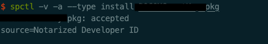

*XCode11 内不再包含Application Loader.app, 相关的指令和功能转移到xcrun altool命令下。所以操作上与XCode10有些区别，本文将一步步介绍整个公证过程的要求和步骤。*

##公证通过的必要条件

以公司MacOSX安装包为例，公证成功的前提如下：

1. 所有binary archive，如app， dylib， framework，kext，以及打包的pkg都需要用developer ID类型证书签名，以其他类型证书签名公证会给出错误原因The binary is not signed with a valid Developer ID certificate。其中pkg需要Developer ID installer类型的证书。
2. 凡是需要签名的内容都需要在Build Settings 的Other Code Signing Flags 选项添加--timestamp，这个选项顾名思义，会在签名时打上时间戳，可以用```codesign -d -vv xxx```看到签名内容中增加了Timestamp项

3. app需要开启hardened Runtime，Hardened Runtime的选项可以根据需要勾选

4. 需要申请公证用的密码，公证时需要提供用户名和密码，用户名是Apple ID的用户名，但密码是另外的，如果使用Apple ID的密码做公证，会收到错误提示Error: code -22016 (Unable to validate your application. We are unable to create an authentication session.)。

5. 创建公证密码

   使用Apple ID登录网站https://appleid.apple.com/account/manage, 可以在安全栏看到App专用密码及生成密码选项，点击后输入密码标签，即可生成可用于公证的密码。生成的密码最好存入keychain便于使用.

   ```security add-generic-password -a $APPLE_ID -w $NOTARIZE_PASSWORD -s MAC_NOTARIZE```

   上面的命令需要将'$APPLE_ID'和'\$NOTARIZE_PASSWORD' 替换为实际apple id和公证密码。后面公证时就可以在命令行中用@keychain:MAC_NOTARIZE获取公证密码了。


## 公证

公证核心命令如下：

```xcrun altool --notarize-app --primary-bundle-id "com.excelsecu.BOCOMUsbKeyTool-SmartKey" --username $APPLE_ID --password "@keychain:MAC_NOTARIZE" --asc-provider $PROVIDER_SHORTNAME --file  $NOTARIZE_TARGET```

其中$NOTARIZE_TARGET 可以是pkg，dmg，zip或者dylib等，app等目录结构需要压缩为zip。

--primary-bundle-id 只需要提供主要的app的bundle id即可。

--username和--password 即公证用户名及密码，上文已说明

--asc-provider 在AppleID存在多个team时是必填项，其实就是apple id可能对应多个开发team，这里需要制定是哪一个team。这里指定team用的是Providershortname可以通过另一个altool指令获取

```xcrun altool --list-providers -u $APPLE_ID -p @keychain:MAC_NOTARIZE```

##

这时一切顺利的话，公证指令就会返回一个请求的uuid，如下：


通过RequestUUID，我们可以查询此次公证的结果

```
xcrun altool -u @APPLE_ID -p @keychain:MAC_NOTARIZE --notarization-info 4bd5cccf-83ab-40ce-b8d6-adb153xxxxx
```

失败的话会显示如下内容:

```
No errors getting notarization info.

          Date: 2020-05-21 05:36:27 +0000
          Hash: b18c87cd1253a023762692bcd02ead403a33d03c4e440f0233108ec0609292b1
    LogFileURL: https://osxapps-ssl.itunes.apple.com/itunes-assets/Enigma123/v4/01/70/57/017057fa-4519-dc33-f106-c1bd811e7b2e/developer_log.json?accessKey=1590233919_963274557925091904_9P1%2BcpMy8TSVBETidZfogZvpQYrFEdD9AnIRqXdu3ITBFlpAlc3Mw1%2F8OItwGh8HXnrkXizARlFCiJbCMYe3ZhQit%2FKEXCxrVtKa9zPEvYBAAt5xsSlBoilRNcK%2BsnzUNwYCs9iP7qxSpzJce%2BcwskknuH7nBXXXXXXXXXXXXXX
   RequestUUID: 4bd5cccf-83ab-40ce-b8d6-adb153xxxxx
        Status: invalid
   Status Code: 2
Status Message: Package Invalid
```

根据访问LogFileURL，可以了解公证失败的原因是因为使用了非Developer ID类型的证书


如果公证通过，那么返回的内容中Status为success。


### 验证

```spctl -v -a $NOTARIZED_APP```

```spctl -v -a --type install $NOTARIZED_INSTALLER```

安装包和App的验证指令稍有区别，安装包需要指定类型为install

显示的结果类似



注意source后带Notarized即为公证成功，否则是不带的。


###装订公证票据

公证实际是告诉MacOSX系统的GateKeeper这个安装包公证过，不需要给出一些烦人的提示。GateKeeper实际是从服务端查询当前安装包或App有无公证票据，在离线情况下就会无法验证。所以最好将公证票据装订到安装包上,支持离线验证。

```xcrun stapler staple $NOTARIZED_TARGET```

然后通过```xcrun stapler staple -v $NOTARIZED_TARGET``` 来查看是否成功


##参考资料

https://developer.apple.com/documentation/xcode/notarizing_macos_software_before_distribution